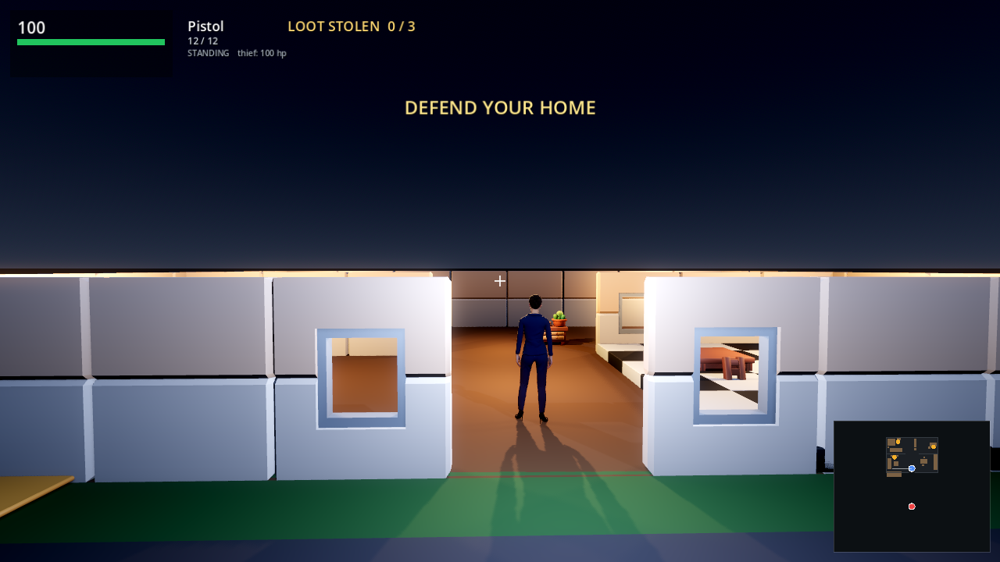

# Home Invasion

A first-person home-defence game. You are the homeowner. A thief arrives by van,
tries to take three valuables, and carries them back to the van. You have a pistol
and a shotgun; he has a pistol. His death ends the round.



## Download and play

Grab the latest build from **[Releases](../../releases/latest)**.

### Windows

Download `Home-Invasion-windows.zip`, unzip it, and run `Home Invasion.exe`.
**No installation and no Godot required** — the engine and all game data are
inside that one file.

Windows SmartScreen may warn that the app is unsigned. Choose **More info** →
**Run anyway**.

### macOS

Download `Home-Invasion-macos.zip` and unzip it, then **right-click the app →
Open → Open**. A normal double-click will be blocked the first time, because the
build is unsigned. You only need to do this once.

## Controls

| Input | Action |
|---|---|
| `W` `A` `S` `D` / arrows | Move |
| `Shift` | Sprint |
| `C` or `Ctrl` | Crouch |
| Mouse | Look and aim |
| Left click | Fire |
| `1` / `2` | Pistol / Shotgun |
| `R` | Reload |
| `Esc` | Release the mouse |
| `Enter` | Restart after a round ends |

## Rules

- **Win** by killing the thief.
- **Lose** if all three valuables reach the van, or if you are killed.
- You have 100 HP and he does 7 damage per shot; he has 100 HP.
- The pistol does 26 damage per hit. The shotgun fires 9 pellets at 13 each with
  a wide spread — lethal up close, useless at range.
- The minimap in the lower right shows him **only when you have line of sight**.
  The lit region is a real visibility cone cast from your position, not a radius.

## Running from source

Requires **Godot 4.7.2**.

```sh
godot --path . 
```

The scene file is intentionally near-empty; the house, lighting and HUD are all
built in code, so the interesting files are:

| File | Contents |
|---|---|
| `scripts/sim.gd` | the game model — movement, AI, combat, theft. Pure logic, no rendering |
| `scripts/game.gd` | wiring: input, camera, HUD, environment |
| `scripts/actor.gd` | character loading, animation merging, weapon attachment |
| `scripts/house.gd` | procedural house from modular parts |
| `scripts/minimap.gd` | the sight-cone minimap |

### Tests

```sh
godot --headless --path . --script test/test_sim.gd
```

20 tests covering movement, collision, the thief's pathing, theft, damage and
win/lose conditions.

## Technical notes

**Characters** are Mixamo rigs. Mixamo's exporter forces a choice: `skin: true`
gives you the mesh *plus one* animation at 48–108 MB, `skin: false` gives the
animation alone at ~0.4 MB. So each character is built from a single
mesh-carrying file, and the other eight clips are merged in at runtime. That took
the asset set from 1.3 GB to 161 MB.

**Two traps worth knowing** if you extend this:

- Mixamo's mesh export contains *two* clips. `Take 001` is the **bind pose** — a
  T-pose with no motion — and `mixamo_com` is the real animation. Playing
  `Take 001` looks like the animation system is broken.
- Animation track paths like `Skeleton3D:mixamorig8_Hips` look like node paths,
  but the `:` is a NodePath *subname* separator. It resolves to the Skeleton3D,
  which interprets the subname as a bone name. It works; it just reads oddly.

**Lighting** is deliberately dark: seven warm interior practicals with real
falloff, a weak cool exterior key, SSAO, glow and ACES tonemapping. One gotcha —
`fog_sky_affect = 1.0` tints the *sky* with the fog colour and crushes the whole
upper frame to black.

## Not in this repository

`assets/mixamo/` is excluded. Mixamo's terms permit commercial use **in a game**
but forbid redistributing the raw assets, and the largest file is 106 MB — over
GitHub's 100 MB per-file limit, so it could not be pushed either way. Build
outputs are excluded for the same size reason and ship as Release assets instead.

## Credits

- Characters: [Mixamo](https://www.mixamo.com) (Adobe)
- Environment art: [KayKit](https://kaylousberg.itch.io/) — CC0
- Additional characters: [Quaternius](https://quaternius.com) — CC0
- Engine: [Godot 4.7.2](https://godotengine.org)
